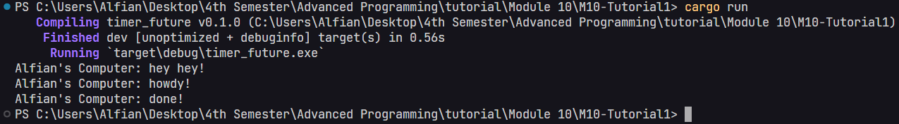

# Reflections

### [1.2]

The reason "Alfian's Computer: hey hey!" is printed first is that it is outside the asynchronous task and executes immediately, while the asynchronous task runs concurrently in the background.

### [1.3] Multiple Spawner

### [1.3] Removed drop(spawner)
